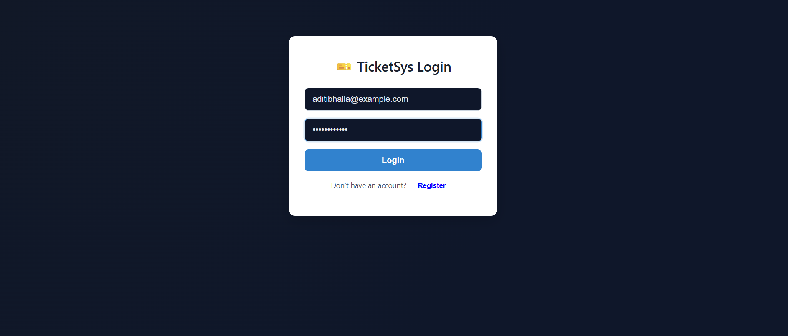
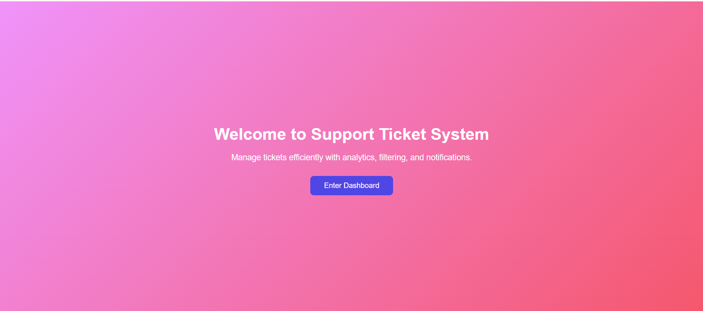
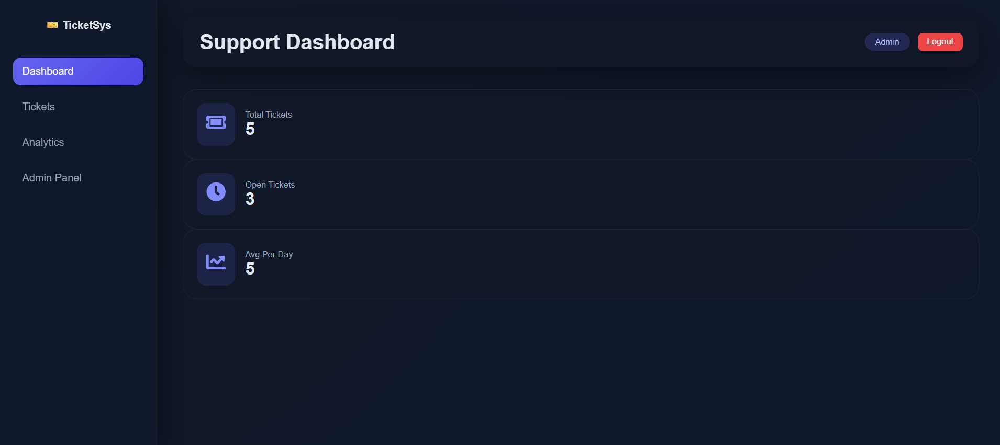
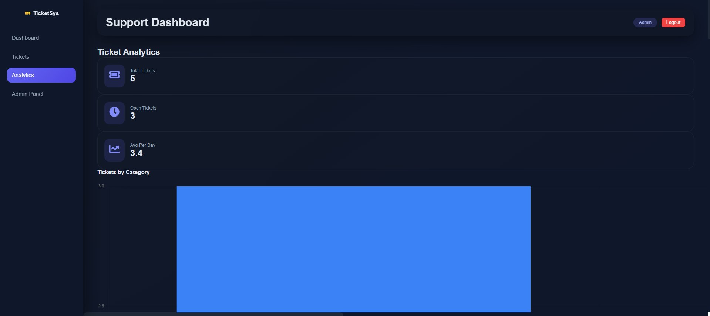
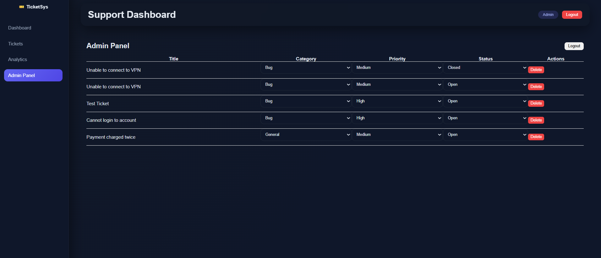
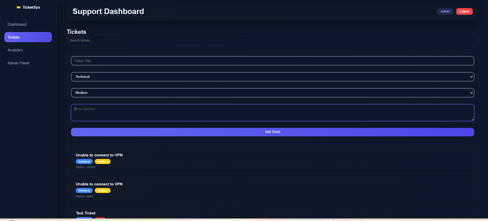

# Support Ticket System

## Overview

This is a **Support Ticket System** built from scratch. Users can:

* Submit support tickets
* Browse, filter, and search tickets
* View aggregated metrics (stats dashboard)

**Key Feature:** When a ticket is submitted, an **LLM automatically categorizes it** and suggests a **priority level** based on the description. Users can review and override these suggestions before submitting.

The frontend is **styled** for readability and user experience while maintaining functionality.

The project is fully **containerized with Docker** for easy deployment.

---

## Tech Stack

* **Backend:** Django + Django REST Framework + PostgreSQL
* **Frontend:** React (with CSS styling)
* **LLM Integration:** OpenAI GPT-4o-mini
* **Infrastructure:** Docker + Docker Compose

---

## Backend

### Ticket Model

| Field       | Type          | Constraints                                                                              |
| ----------- | ------------- | ---------------------------------------------------------------------------------------- |
| title       | CharField     | max_length=200, required                                                                 |
| description | TextField     | required                                                                                 |
| category    | CharField     | choices: billing, technical, account, general — auto-suggested by LLM, user can override |
| priority    | CharField     | choices: low, medium, high, critical — auto-suggested by LLM, user can override          |
| status      | CharField     | choices: open, in_progress, resolved, closed — defaults to open                          |
| created_at  | DateTimeField | auto-set on creation                                                                     |

All constraints are enforced at the **database level**.

---

### API Endpoints

| Method | Endpoint                 | Description                                                                                          |
| ------ | ------------------------ | ---------------------------------------------------------------------------------------------------- |
| POST   | `/api/tickets/`          | Create a new ticket (returns 201)                                                                    |
| GET    | `/api/tickets/`          | List all tickets, newest first. Supports filters: `?category=`, `?priority=`, `?status=`, `?search=` |
| PATCH  | `/api/tickets/<id>/`     | Update ticket (status, category, priority)                                                           |
| GET    | `/api/tickets/stats/`    | Return aggregated stats using **DB-level aggregation**                                               |
| POST   | `/api/tickets/classify/` | Return LLM-suggested category and priority                                                           |

**Stats Endpoint Example:**

```json
{
  "total_tickets": 124,
  "open_tickets": 67,
  "avg_tickets_per_day": 8.3,
  "priority_breakdown": { "low": 30, "medium": 52, "high": 31, "critical": 11 },
  "category_breakdown": { "billing": 28, "technical": 55, "account": 22, "general": 19 }
}
```

---

### LLM Integration

* Endpoint `/api/tickets/classify/` accepts:

```json
{ "description": "User issue description..." }
```

* Returns:

```json
{ "suggested_category": "technical", "suggested_priority": "high" }
```

* **Prompt used:**

```
You are a support ticket classifier.

Categories: billing, technical, account, general
Priorities: low, medium, high, critical

Return ONLY valid JSON like:
{
  "suggested_category": "...",
  "suggested_priority": "..."
}

Ticket description: {description}
```

* Frontend pre-fills category and priority dropdowns with these suggestions. Users can override them.

> **Note:** If the LLM is unreachable or returns invalid JSON, the ticket will still submit using defaults:
> `category: general`, `priority: medium`

---

## Frontend (Styled)

* **Ticket Submission Form**

  * Inputs: Title, Description
  * Category & Priority pre-filled from LLM, editable
  * Shows loading spinner while LLM classifies
  * Clears form on success

* **Ticket List**

  * Displays newest tickets first
  * Shows title, truncated description, category, priority, status, timestamp
  * Filters: category, priority, status
  * Search bar filters by title & description
  * Inline status update buttons (styled)

* **Stats Dashboard**

  * Displays total tickets, open tickets, avg per day, priority & category breakdown
  * Auto-refresh on new ticket submission
  * Styled with CSS for readability

* **Styling:** Plain CSS (or CSS-in-JS if preferred), responsive layout optional but included

---

## Frontend Screenshots

### Authentication



### Landing Page



### Dashboard



### Analytics



### Admin Panel



### Tickets

1. **Tickets List**
   
2. **Ticket Description**
   

---

## Docker Setup

**Requirements:** Docker & Docker Compose installed.

**Run the app:**

```bash
docker-compose up --build
```

* **Backend:** Django + DRF + PostgreSQL
* **Frontend:** React app
* **LLM API key:** Passed via environment variable `OPENAI_API_KEY`

**Backend DB wait, migrations, and server start** are automated via `wait-for-db.sh`.

**Ports:**

* Backend: `http://localhost:8000`
* Frontend: `http://localhost:3000`

---

## Running Locally Without Docker

```bash
# Backend
cd backend
pip install -r requirements.txt
python manage.py migrate
python manage.py runserver

# Frontend
cd frontend
npm install
npm start
```

**Note:** Frontend will fetch API from `http://localhost:8000/api` in local development.

---

## Design Decisions

* **LLM Choice:** OpenAI GPT-4o-mini — lightweight, fast, and reliable for ticket classification.
* **Fallbacks:** Defaults (`general` / `medium`) if LLM fails.
* **Dockerization:** Full containerization ensures reviewer can run the app with a **single command**.
* **Frontend Styling:** Minimal CSS for usability, clarity, and readability.

---


